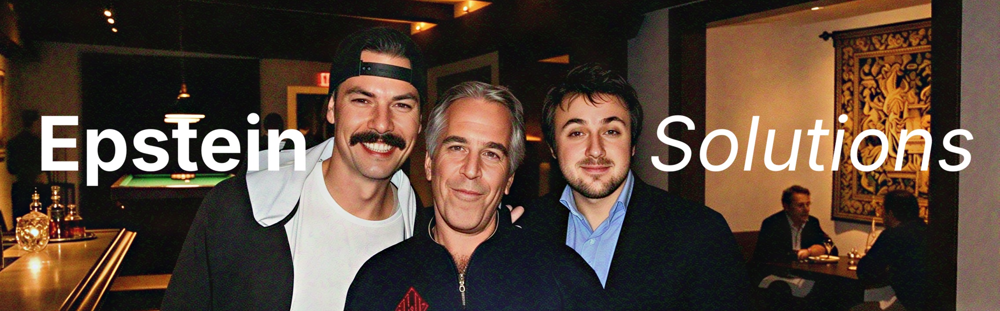

# BA Model viewer

An AI sloppy model viewer for buruaka using Three.js



## Features

- Model
- Halo
- Props
- FX (I broke it)

## How to import

Install dependencies first:

```bash
pip install UnityPy numpy trimesh
```

1. Export character (I choose Kei)

```bash
python tools/export_character.py CH0335
```

2. Dump FX from animation events (I broke FX, so you shouldn't)

```bash
python tools/fx/dump_fx.py CH0335 --from-anim-events
```

3. Rebuild viewer index

```bash
python tools/indexing/build_index.py
```

And you're done.

## Tools

- `bundle_resolver.py`: Resolves character bundles, common dependencies, and CAB references from `cab_index.json`.
- `animation_clip_decoder.py`: Decodes Unity `AnimationClip` into animation metadata/TRS channels for glTF runtime.
- `skinned_gltf.py`: Exports `SkinnedMeshRenderer` to `.glb` with skin/bones/animation. Mostly for fine-tuning model exports.
- `external_prop_attach.py`: You actually don't need this.
- `export_halo_mesh.py`: Exports static halo mesh and halo metadata.

## Disclaimer

This is an unofficial fan/personal project and is not affiliated with or endorsed by NEXON, Yostar, or Blue Archive. All trademarks, characters, and game assets belong to their respective owners. Use responsibly and don't use this for cheating, monetization, or evil gamer crimes.
